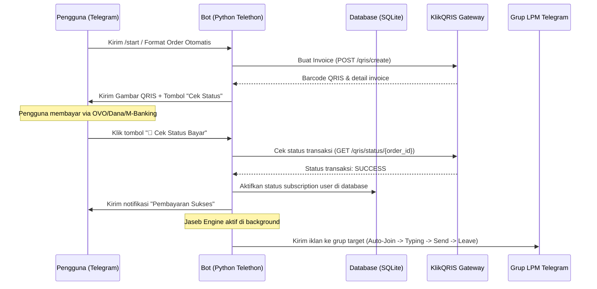

# 🤖 GEUNID-JASEB: Bot Jasa Sebar Telegram & Userbot Autopilot 

Selamat datang di **GEUNID-JASEB**, ekosistem jasa sebar (Jaseb) iklan Telegram otomatis tercanggih dan teraman. Proyek ini menggabungkan kekuatan **Backend Python (Telethon)** yang tangguh dengan **Frontend Telegram Mini App (Next.js)** yang interaktif dan modern.

Proyek ini dirancang agar sangat ramah bagi pemula, ringan untuk handphone spesifikasi rendah (*low-tier device*), aman dari banned, dan terintegrasi otomatis dengan sistem pembayaran QRIS.

---

## 🌟 FITUR UTAMA & CARA KERJANYA

Sistem GEUNID-JASEB terbagi menjadi dua bagian utama yang bekerja bersamaan secara real-time:

### 1. 📱 Telegram Mini App (Frontend - Next.js)
Aplikasi web yang terbuka langsung secara melayang di dalam aplikasi Telegram Anda saat mengeklik tombol **"GEUNID JASEB"**.
*   **Visual Mewah & Ringan:** Didesain dengan nuansa premium biru-putih, menggunakan animasi super mulus yang tidak membebani baterai dan RAM HP.
*   **Checkout & Manajemen Paket:** Pengguna dapat memilih durasi paket (3, 5, 7, 10, 14, 30 hari) dan kapasitas target grup (20 atau 30 LPM).
*   **Alur Multi-Akun (Ubot):** Memungkinkan pembelian ubot untuk banyak akun sekaligus secara praktis dengan memasukkan daftar UserID tujuan.
*   **⚡ Fitur Gratis (Tanpa Login):**
    *   **AI Wording Beautifier:** Pengubah teks iklan biasa menjadi teks promosi yang menarik dengan template instan (*Premium, Minimalist, Flash Style*).
    *   **LPM Scanner Helper:** Membantu memformat perintah `/scan` untuk dikirim ke bot Telegram.

### 2. 🤖 Telegram Bot & Jaseb Engine (Backend - Python Telethon)
Mesin utama yang memproses seluruh perintah, mengelola database SQLite, dan mengeksekusi pengiriman iklan.
*   **🛡️ Stealth Mode Humanoid AI:** Bot meniru perilaku asli manusia saat mengirim iklan ke grup LPM:
    1.  Otomatis masuk ke grup target (*Auto-Join*).
    2.  Mengirimkan status **"sedang mengetik..."** (*typing action*) selama 3-7 detik.
    3.  Mengirimkan teks iklan beserta gambar/video.
    4.  Otomatis keluar dari grup target (*Auto-Leave*) agar daftar obrolan Telegram pengguna tetap bersih.
*   **⏳ Jeda Pengiriman Fleksibel:**
    *   `Slowly Mode`: Memberikan jeda aman 30-60 detik tiap grup untuk meminimalkan deteksi bot anti-spam.
    *   `Instant Mode`: Mengirim cepat antar grup (3-5 detik), lalu melakukan jeda panjang (15-30 menit) di setiap akhir putaran.
*   **🛡️ Anti-Flood & Rate Limit (FloodWait):** Jika Telegram memberikan pembatasan frekuensi (Error 429), bot secara otomatis tidur (sleep) sesuai durasi limit dan menyimpan log status kegagalannya.
*   **💳 KlikQRIS Payment Gateway:** Menghasilkan barcode QRIS dinamis di dalam chat Telegram secara instan. Pengguna cukup memindai, membayar, lalu mengeklik tombol **"🔄 Cek Status Bayar"** untuk mengaktifkan paket secara otomatis 24 jam non-stop.
*   **🔍 Crowdsourced LPM Scanner:** Memungkinkan admin memindai ribuan grup LPM melalui perintah `/scan @username_grup`. Grup yang aktif dan valid akan langsung disimpan ke database cluster global Anda untuk memperkaya daftar LPM secara otomatis!

---

## 🛠️ CARA KERJA SISTEM (UNDER THE HOOD)



---

## ⚙️ PANDUAN KONFIGURASI (FILE `.env`)

Sebelum menjalankan proyek, Anda wajib membuat berkas bernama `.env` di root folder dan mengisi variabel berikut:

```env
API_ID=33241986                         # Dapatkan dari my.telegram.org
API_HASH=3ac3dfb73b9b34f471a22b...       # Dapatkan dari my.telegram.org
BOT_TOKEN=8901501719:AAG6kyPNUl...      # Dapatkan dari @BotFather
ADMIN_ID=8844645901                     # User ID Telegram Anda (sebagai Admin)
DB_PATH=data/jaseb.db                   # Lokasi penyimpanan database SQLite
KLIKQRIS_API_KEY=MSkw9B8L40L9yw...       # API Key merchant dari KlikQRIS
KLIKQRIS_MERCHANT_ID=178075934651       # Merchant ID dari KlikQRIS
CHANNEL_USERNAME=@geunidk               # Username channel resmi Anda (wajib join)
ADMIN_USERNAME=@Geun_ID                 # Username bantuan admin Anda
```

---

## 🚀 CARA MENJALANKAN SECARA LOKAL (PENGEMBANGAN)

### 1. Jalankan Backend (Python Bot)
Pastikan Python 3.10 ke atas sudah terinstal di komputer Anda.

```bash
# 1. Masuk ke root directory
cd botjasebgeunid

# 2. Install library yang dibutuhkan
pip install -r requirements.txt

# 3. Jalankan bot Python
python -m src.main
```

### 2. Jalankan Frontend (Next.js)
Pastikan Node.js sudah terinstal di komputer Anda.

```bash
# 1. Masuk ke folder frontend
cd frontend

# 2. Install dependensi NPM
npm install

# 3. Jalankan development server
npm run dev
```
Aplikasi web Next.js akan berjalan secara lokal di alamat `http://localhost:3000`.

---

## 📦 PANDUAN DEPLOYMENT (ONLINE)

### 1. Frontend ke Vercel (Gratis)
*   Hubungkan akun Vercel ke repositori GitHub Anda.
*   **PENTING:** Atur **Root Directory** ke **`frontend`** pada pengaturan project di Vercel.
*   Biarkan kolom Environment Variables kosong (tidak membutuhkan `.env`).
*   Klik **Deploy**.

### 2. Backend ke Railway
*   Hubungkan repositori GitHub Anda ke Railway.
*   Railway akan mendeteksi `Dockerfile` secara otomatis untuk mem-build server.
*   **PENTING:** Masukkan seluruh variabel lingkungan `.env` Anda ke tab **Variables** di Railway.
*   **PENTING (SQLite Volume):** Karena database menggunakan SQLite, buatlah **Volume** baru di tab settings Railway Anda dengan ukuran minimum 1 GB, dan arahkan **Mount Path** ke **`/app/data`** agar data langganan user Anda tidak hilang setiap kali bot melakukan restart.

---

## 💬 DAFTAR PERINTAH BOT TELEGRAM (COMMANDS)

*   `/start` - Membuka menu utama. (Untuk pengguna biasa, bot hanya akan menampilkan Mini App, profil, SNK, dan tombol hubungi bantuan. Bagi Admin, menu transaksi, paket, dan login userbot akan terbuka secara penuh).
*   `/install` - Menghubungkan akun ubot Telegram baru via OTP secara instan (Khusus Admin).
*   `/scan` - Memindai daftar grup LPM secara asinkron (Khusus Admin).

---
*Dibuat secara orisinal dengan performa tinggi & standar keamanan terbaik.*
