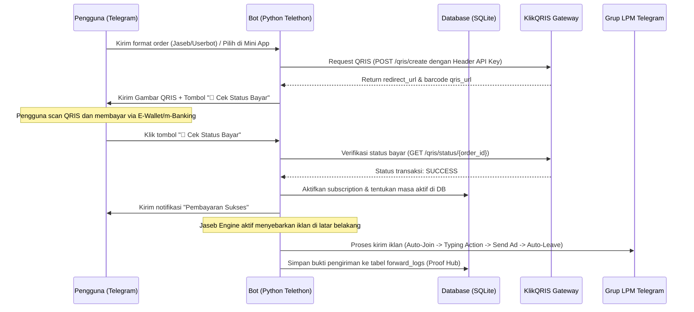

# 🤖 GEUNID-JASEB: Bot Jasa Sebar Telegram & Userbot Autopilot 

Selamat datang di **GEUNID-JASEB**! Jika Anda adalah pencipta atau pengembang yang ingin memahami bagaimana sistem ini bekerja, apa saja fiturnya, serta cara menggunakan dan menjalankannya, dokumen ini dirancang khusus untuk Anda.

Sistem ini adalah ekosistem jasa sebar (Jaseb) iklan Telegram otomatis tercanggih yang menggabungkan **Backend Python (Telethon)** untuk otomasi Telegram tingkat tinggi dengan **Frontend Telegram Mini App (Next.js)** yang responsif dan berpenampilan premium.

---

## 📖 DAFTAR ISI
1. [Konsep Dasar: Apa itu Jaseb & Userbot?](#-konsep-dasar-apa-itu-jaseb--userbot)
2. [Fitur-Fitur Utama](#-fitur-fitur-utama)
3. [Alur & Cara Kerja Sistem (Di Balik Layar)](#-alur--cara-kerja-sistem-di-balik-layar)
4. [Struktur Basis Data (Database SQLite)](#-struktur-basis-data-database-sqlite)
5. [Konfigurasi Variabel Lingkungan (`.env`)](#-konfigurasi-variabel-lingkungan-env)
6. [Panduan Menjalankan Secara Lokal (Lokal PC)](#-panduan-menjalankan-secara-lokal-lokal-pc)
7. [Panduan Deployment (Online Cloud)](#-panduan-deployment-online-cloud)
8. [Panduan Penggunaan Perintah (Bot Commands)](#-panduan-penggunaan-perintah-bot-commands)

---

## 💡 KONSEP DASAR: APA ITU JASEB & USERBOT?

Sebelum masuk ke teknis, mari pahami tiga pilar layanan yang ditawarkan oleh sistem ini:

*   **Jasa Sebar (Jaseb) Regular:** Layanan sebar iklan otomatis ke grup LPM menggunakan akun bot/admin. Memiliki watermark toko, tidak mendukung pengiriman media (foto/video), dan tidak mendukung emoji premium. Cocok untuk promosi teks sederhana dengan biaya sangat murah.
*   **Jasa Sebar (Jaseb) Forward:** Layanan sebar iklan tanpa watermark (murni nama toko Anda) yang mendukung file media (foto/video), emoji premium, serta membantu meningkatkan jumlah tayangan pesan (*view booster*) karena dikirim melalui metode forward pesan dari channel resmi Anda.
*   **Userbot Autopilot:** Sistem yang mengaitkan akun Telegram pribadi pembeli (via OTP/2FA aman) ke engine autopilot. Akun pembeli akan menyebarkan iklannya sendiri ke grup-grup LPM secara otomatis di latar belakang tanpa perlu membuka aplikasi Telegram atau menggunakan HP.

---

## 🌟 FITUR-FITUR UTAMA

Ekosistem **GEUNID-JASEB** dibagi menjadi dua bagian yang bekerja secara terintegrasi dan real-time:

### 1. Telegram Mini App (Frontend Next.js)
Mini App berjalan langsung secara melayang di dalam aplikasi Telegram saat user mengeklik tombol **"Buka Mini App"**. Fitur-fiturnya meliputi:
*   **Desain Premium & Ringan:** Antarmuka bergaya kaca modern (*glassmorphism*) dengan animasi transisi yang sangat mulus tanpa membebani memori HP.
*   **Konfigurator Paket & Harga Dinamis:** Pengguna dapat memfilter paket berdasarkan durasi (3, 5, 7, 10, 14, atau 30 hari) dan kapasitas LPM (20 atau 30 LPM).
*   **Otomasi Checkout Multi-Akun:** Untuk paket Userbot, pengguna dapat membeli lisensi untuk banyak akun sekaligus secara instan dengan memasukkan daftar UserID tujuan.
*   **Fitur Gratis Tanpa Login (Tools Tab):**
    *   **Wording Beautifier:** Mengubah teks promosi biasa menjadi teks iklan yang indah dan menarik menggunakan template siap pakai (*Premium, Minimalist, Flash Sale*).
    *   **LPM Auto-Scanner Helper:** Membantu memformat perintah `/scan` grup LPM secara massal sehingga pengguna tinggal menyalin perintah tersebut ke bot Telegram.

### 2. Telegram Bot & Jaseb Engine (Backend Python Telethon)
Mesin backend yang bertugas menangani interaksi chat, pemrosesan transaksi, serta eksekusi pengiriman iklan:
*   **Stealth Mode Humanoid AI:** Saat menyebarkan iklan ke grup LPM, bot meniru perilaku asli manusia untuk meminimalkan risiko banned:
    1.  **Auto-Join:** Bot bergabung ke grup LPM tujuan secara otomatis (jika belum terdaftar).
    2.  **Typing Simulation:** Bot mengirimkan status *"sedang mengetik..."* selama 3 hingga 7 detik sebelum mengirim iklan.
    3.  **Send Ad:** Mengirimkan pesan iklan (teks, foto, atau video) dan tetap berada di dalam grup secara permanen untuk menghindari pembatasan limit join ulang dari Telegram.
*   **Pilihan Ritme Pengiriman (Delay Mode):**
    *   `Slowly Mode`: Memberikan jeda aman selama 30-60 detik antar grup. Sangat direkomendasikan untuk keamanan akun.
    *   `Instant Mode`: Mengirim cepat ke setiap grup (jeda 3-5 detik), lalu melakukan jeda istirahat panjang (15-30 menit) di setiap akhir putaran grup.
*   **Anti-Flood & Rate Limit Resilience:** Jika bot terkena pembatasan frekuensi pesan dari Telegram (Error 429 - `FloodWaitError`), backend akan secara otomatis menidurkan proses pengiriman selama durasi detil yang diminta Telegram, lalu melanjutkan pengiriman setelah limit selesai.
*   **Integrasi KlikQRIS Gateway:** Memungkinkan pembuatan barcode pembayaran QRIS dinamis secara instan di chat Telegram. Pengguna tinggal memindai QRIS, membayar melalui E-Wallet/m-Banking apa pun, lalu menekan tombol **"🔄 Cek Status Bayar"** untuk mengaktifkan paket secara otomatis 24 jam non-stop.
*   **Crowdsourced LPM Scanner:** Fitur bagi admin untuk memeriksa keaktifan grup LPM secara massal via `/scan`. Grup LPM yang aktif dan valid akan langsung disimpan ke database cluster global Anda untuk memperkaya daftar LPM secara otomatis!

---

## 🛠️ ALUR & CARA KERJA SISTEM (DI BALIK LAYAR)

Berikut adalah diagram alur bagaimana pengguna membeli paket hingga iklan disebarkan oleh engine:



---

## 🗄️ STRUKTUR BASIS DATA (DATABASE SQLite)

Semua data disimpan di dalam database SQLite lokal (secara default di `data/jaseb.db`). Berikut adalah tabel-tabel utama beserta fungsinya:

1.  **`users`**: Menyimpan profil dasar setiap pengguna yang berinteraksi dengan bot.
    *   *Kolom:* `user_id` (PK), `username`, `full_name`, `joined_at`
2.  **`subscriptions`**: Mencatat paket langganan jaseb atau userbot yang sedang aktif.
    *   *Kolom:* `id` (PK), `user_id` (FK), `package_name`, `capacity_lpm`, `start_date`, `end_date`, `status`
3.  **`user_ads`**: Menyimpan materi iklan (teks, caption, dan path gambar/video) milik pengguna.
    *   *Kolom:* `id` (PK), `user_id` (FK), `title`, `content`, `media_path`, `created_at`
4.  **`lpm_lists`**: Cluster global daftar grup LPM aktif hasil scan.
    *   *Kolom:* `id` (PK), `group_link` (Unique), `group_id`, `group_name`, `member_count`, `last_active`, `is_active`
5.  **`transactions`**: Log pembayaran yang dibuat melalui sistem KlikQRIS.
    *   *Kolom:* `id` (PK), `user_id` (FK), `trx_id` (Unique), `package_id`, `amount`, `status`, `payment_url`, `created_at`
6.  **`forward_logs`**: Bukti pengiriman iklan (*Proof Hub*) ke setiap grup LPM secara detail.
    *   *Kolom:* `id` (PK), `user_id` (FK), `ad_id` (FK), `group_id`, `msg_link`, `status` (`success`/`failed`), `error_msg`, `sent_at`
7.  **`userbots`**: Menyimpan status koneksi sesi userbot pembeli.
    *   *Kolom:* `user_id` (PK), `phone_number`, `session_name`, `status` (`connected`/`disconnected`), `created_at`

---

## ⚙️ KONFIGURASI VARIABEL LINGKUNGAN (`.env`)

Buat berkas bernama `.env` di direktori utama (root) proyek dan isi dengan variabel berikut:

```env
# Telegram API Credentials (Dapatkan dari https://my.telegram.org)
API_ID=33241986
API_HASH=3ac3dfb73b9b34f471a22b...

# Bot Token (Dapatkan dari Telegram @BotFather)
BOT_TOKEN=8901501719:AAG6kyPNUl...

# Konfigurasi Admin (ID Telegram Anda)
ADMIN_ID=8844645901
ADMIN_USERNAME=@Geun_ID

# Database Path
DB_PATH=data/jaseb.db

# KlikQRIS Payment Gateway Credentials
KLIKQRIS_API_KEY=MSkw9B8L40L9yw...
KLIKQRIS_MERCHANT_ID=178075934651

# Channel Informasi Toko (User wajib bergabung sebelum menggunakan bot)
CHANNEL_USERNAME=@geunidk
```

---

## 🚀 PANDUAN MENJALANKAN SECARA LOKAL (LOKAL PC)

### 1. Prasyarat Sistem
*   **Python:** Versi 3.10 atau lebih baru.
*   **Node.js:** Versi 18 atau lebih baru.
*   **Git:** Untuk kloning repositori.

### 2. Langkah Menjalankan Backend (Python Bot)
Buka terminal/command prompt baru, lalu jalankan perintah berikut:
```powershell
# Masuk ke direktori proyek
cd "d:\Bot Jaseb"

# Install seluruh dependensi pustaka Python
pip install -r requirements.txt

# Jalankan bot Python
python -m src.main
```

### 3. Langkah Menjalankan Frontend (Next.js Mini App)
Buka terminal baru yang terpisah, lalu jalankan perintah berikut:
```powershell
# Masuk ke direktori frontend Next.js
cd "d:\Bot Jaseb\frontend"

# Install dependensi modul NPM
npm install

# Jalankan dev server Next.js secara lokal
npm run dev
```
Aplikasi web Next.js kini berjalan di alamat lokal: `http://localhost:3000`.

---

## 📦 PANDUAN DEPLOYMENT (ONLINE CLOUD)

Agar sistem dapat diakses secara online 24 jam oleh pengguna lain di Telegram:

### 1. Frontend ke Vercel (Gratis)
1.  Unggah kode Anda ke GitHub.
2.  Masuk ke dashboard **Vercel** Anda dan impor repositori GitHub tersebut.
3.  Di menu konfigurasi project, set **Root Directory** ke **`frontend`**.
4.  Kosongkan kolom Environment Variables (karena Mini App memperoleh data dinamis langsung dari URL query parameter Telegram Bot).
5.  Klik **Deploy**. Setelah selesai, salin URL domain yang diberikan oleh Vercel (misal: `https://geunid-jaseb.vercel.app`).

### 2. Backend ke Railway
1.  Buat project baru di **Railway** dan hubungkan ke repositori GitHub Anda.
2.  Railway akan mendeteksi `Dockerfile` secara otomatis untuk merakit server Python.
3.  Masukkan seluruh isi variabel dari file `.env` lokal Anda ke tab **Variables** di panel Railway.
4.  **SANGAT PENTING (Persistent SQLite Volume):**
    *   Karena database menggunakan SQLite (`data/jaseb.db`), datanya akan terhapus setiap kali bot melakukan restart atau pembaruan kode jika Anda tidak menggunakan Volume.
    *   Di dashboard Railway Anda, tambahkan **Volume** baru (misal ukuran 1 GB).
    *   Atur **Mount Path** volume tersebut ke **`/app/data`**. Hal ini memastikan database langganan pengguna Anda tetap aman dan tidak pernah terhapus.

---

## 💬 PANDUAN PENGGUNAAN PERINTAH (BOT COMMANDS)

*   `/start` - Membuka menu utama bot.
    *   *Pengguna Biasa:* Hanya akan melihat opsi Mini App, profil, SNK, dan tombol hubungi admin `@Geun_ID`.
    *   *Admin:* Dapat melihat opsi menu pembayaran, menu paket, dan tombol integrasi login userbot.
*   `/install` *(Khusus Admin)* - Perintah cepat untuk menyambungkan akun userbot baru menggunakan alur interaktif (Nomor HP -> Kode OTP -> Password 2FA).
*   `/scan` *(Khusus Admin)* - Melakukan pemindaian grup LPM secara massal. Contoh: `/scan @lpm_grup1 @lpm_grup2`. Hasil grup yang aktif akan langsung terverifikasi secara otomatis dan masuk ke database cluster LPM global Anda.

---
*GEUNID-JASEB dikembangkan dengan efisiensi tinggi, arsitektur kokoh, dan kenyamanan pengguna maksimal.*
