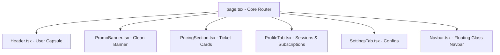

# 🎨 Proposal Desain Premium: "Fancy, Elegant & Professional Edition"

Dokumen ini merinci rencana transformasi frontend **GEUNID-JASEB** menjadi antarmuka minimalis mewah (**Light Premium Mode**) yang memadukan kesederhanaan, keanggunan, dan kesan profesional yang kuat.

---

## 🖼️ Konsep Visual Mockup (Fancy & Elegant)

Berikut adalah visualisasi konsep desain mewah bersih. Konsep ini menggunakan latar belakang putih es (*frost white*), efek kaca buram (*frosted glassmorphism*), dan tipografi yang sangat rapi untuk memberikan kesan premium, tepercaya, dan profesional.

---

## 📊 Matriks Karakter Desain

| Parameter | Karakter Futuristik (Dibatalkan) | Karakter Fancy & Professional (Pilihan Baru) |
|---|---|---|
| **Latar Belakang** | Hitam Obsidian (`#0B0F19`) - Terlalu gelap & mencolok. | Putih Es (`#F8FAFC`) - Terlihat bersih, luas, dan nyaman. |
| **Glow & Border** | Pendaran neon terang biru/ungu. | Bayangan lembut (*soft shadows*) (`shadow-sm`) & border abu-abu tipis (`#E2E8F0`). |
| **Kaca Konten** | Glassmorphism gelap transparan. | *Frosted glassmorphism* putih susu transparan (`bg-white/70 backdrop-blur-xl`). |
| **Warna Utama** | Neon Blue & Royal Purple Glow. | Telegram Blue (`#2481CC`) & Aksen Indigo (`#4A90E2`) yang disajikan secara minimalis. |
| **Kesan Visual** | Cyberpunk, geeky, dinamis. | **Mewah, elegan, mapan, dan sangat profesional.** |

---

## 🏗️ Rencana Modularisasi & Kualitas Kode (Senior Engineering)

Untuk menyeimbangkan keindahan visual dengan kebersihan kode di backend frontend, kita akan membagi file monolith `page.tsx` saat ini menjadi komponen yang bersih dan teratur:

### Langkah Selanjutnya:
1. **Pemisahan Berkas**: Memindahkan bagian-bagian UI dari `page.tsx` ke file terpisah di `frontend/src/components/` (misalnya `Header.tsx`, `Navbar.tsx`, dan `PricingSection.tsx`).
2. **Optimalisasi CSS**: Merapikan token styling di `src/styles/globals.css` agar memantulkan estetika Apple Light Mode yang elegan.
3. **Pengujian Build**: Memastikan tidak ada kesalahan tipe TypeScript pasca pemisahan kode.
